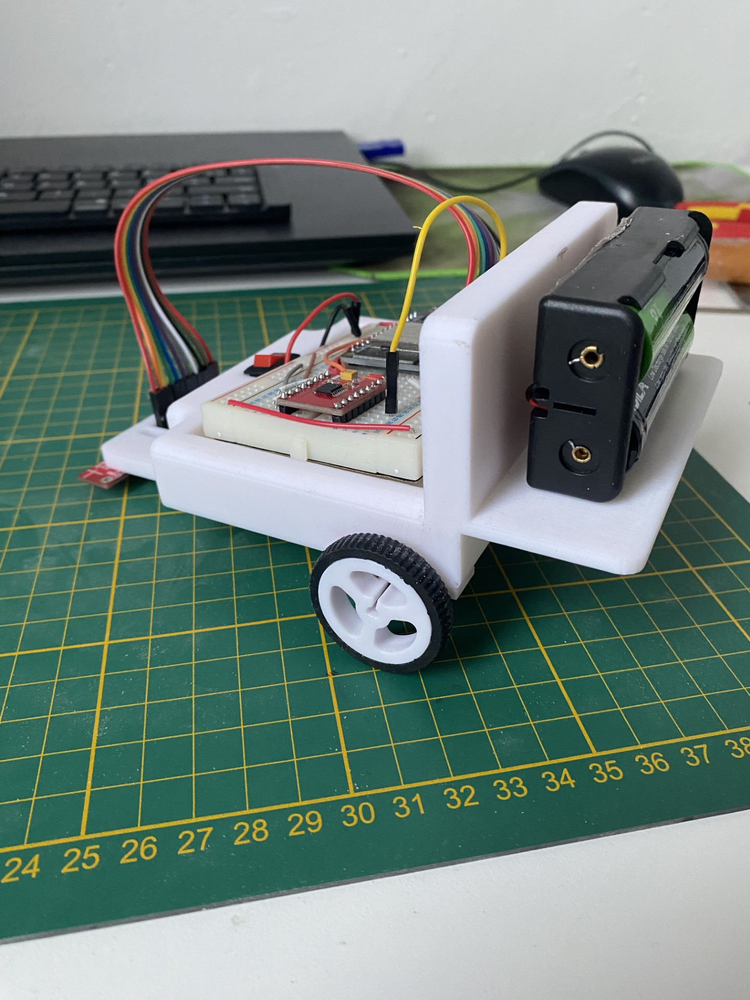

# LineFollower Daan Flinterman 3AMA 2024

lege repository die je als template kan gebruiken om een eigen repository te starten voor uw linefollower project

  
## specifications

microcontroller: ESP32

motors: Micro Metal Gearmotor 50:1

h-bridge: DRV8833

sensors: QTR-8A Sensor Array

batteries: 2 x 18650 Li-Ion

wireless communication: Internal bluetooth module (ESP-32)

distance sensor - motors: 108mm

weight:316g

speed: 0,42m/s

